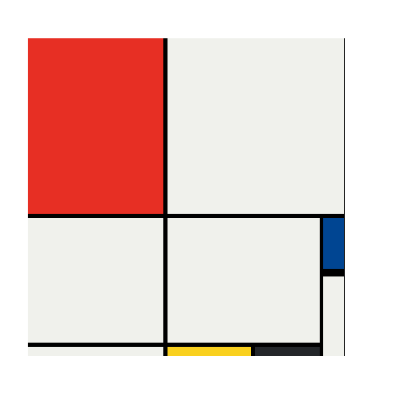

# 🎨 Mondrian Project – HTML & CSS

This is my second web development project where I recreated a Mondrian-style layout using CSS Grid.

## 🔧 Technologies Used
- HTML5
- CSS3 (CSS Grid)

## 📌 Features
- Mondrian-inspired grid layout
- Pure CSS Grid implementation
- Use of grid rows, columns, spans, and gaps
- Clean and structured layout

## 🌐 Live Demo
👉 https://kaushikshivam-stack.github.io/mondrian-project-/

## 🙌 What I Learned
- CSS Grid fundamentals
- grid-template-rows and columns
- grid-area and span usage
- How to build complex layouts using CSS only

## 📸 Project Screenshots

⭐ This project helped me revise my CSS Grid knowledge and stay consistent in my web development journey!
